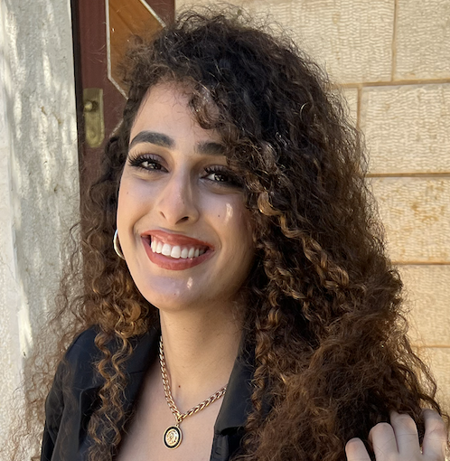

# Hi, I'm Areen Khalaila

I research, design, and engineer solutions at the intersection of accessibility and technology.

I am currently pursuing a Bachelor of Science in Computer Science, with a minor in Physics, at [Brandeis University](https://www.brandeis.edu/), where I am a member of the Phi Beta Kappa honor society. My senior honors thesis, advised by Prof. Dylan Cashman, explores visual perception studies with tactile representations of data for visually impaired users.

I am a Research Intern at the [Human-Computer Interaction Institute](https://hcii.cmu.edu/) at [Carnegie Mellon University](https://www.cmu.edu/). I have conducted research under the guidance of [Patrick Carrington](https://www.patrickcarrington.com/) and Franklin Mingzhi Li, using AI to enhance cooking experiences for visually impaired individuals. 

I am always open to new opportunities and collaborations. Feel free to reach out to me via email at first name kh at brandeis dot edu or on [LinkedIn](https://www.linkedin.com/in/areenkh). Check out my [GitHub](https://github.com/areenkh).

<!-- Upcoming: Adobe, Atlassian?, Highcharts, UW-Madison's WGNHS, ?? -->

<picture>
  <source srcset='images/areenkh.png' type='image/png' />
  
</picture>

{:.no-list}
* <a href="mailto:{{ site.email }}">{{ site.email }}</a>
* {{ site.address }}

Fun fact about me is my name  
in Arabic means lion's den.

<!-- ## Featured <a href="{{ "/projects/" | relative_url }}">Projects</a>

  
  
    
      
    
  

<a href="{{ "/projects/" | relative_url }}" class="button">
  <i class="fas fa-chevron-circle-right"></i>
  Show More Projects
</a> -->

<!-- ## Featured <a href="{{ "/publications/" | relative_url }}">Publications</a>

  
  
    
      <a href="{{ pub.html }}" class="publication">
        <strong>{{ pub.title }}</strong>
        {{ author }}, .
        <i>{{ pub.venue }}, {{ pub.year }}</i>.
         <i class="fas fa-trophyaward" aria-hidden="true"></i> {{ award }}
      </a>
    
  

<a href="{{ "/publications/" | relative_url }}" class="button">
  <i class="fas fa-chevron-circle-right"></i>
  Show All Publications
</a> -->

<!-- ## My background

In 2021, I came to the United States as an international student to pursue an undergraduate degree at [Brandeis University](https://www.brandeis.edu/) in the Boston area. My passion for computer science began in eighth grade, learning to code in C# and later expanding into web development with ASP.NET. Recognizing my achievements, Brandeis awarded me a prestigious full-ride scholarship, which is given to 1 student every 4 years.

Thanks to my strong coding background, I became a teaching assistant in my first year at Brandeis. I am now a Head Teaching Assistant and lead weekly recitations while managing grading tasks and coordinating with other TAs.

At the Brandeis Visual Analytics Lab, under the guidance of Professor Dylan Cashman, we work on research focusing on visual perception studies with tactile data for visually impaired users. Additionally, I am a student researcher at the [Human-Computer Interaction Institute](https://hcii.cmu.edu/) at [Carnegie Mellon University](https://www.cmu.edu/). At the AXLE Lab, under the guidance of [Patrick Carrington](https://www.patrickcarrington.com/), I research assistive technology to enhance cooking experiences for visually impaired individuals. -->

<!-- Upcoming: Adobe, Atlassian?, Highcharts, UW-Madison's WGNHS, ?? -->

<!-- 
 -->

## Latest News

<ul>

  <li></li>

</ul>

## Highlights from My Journey

  

    
    
Final Poster Presentation at CMU HCII REU 2024

  

  

    
    
Brandeis URCC Research Symposium 2024

  

  

    
    
High School Graduation

  

  

    
    
CMU HCII REU Orientation

  

  

    
    
Coding Camp in 2021

  

  <!-- Add more photos as needed -->

<!-- 

## Latest Visits

<table>
<tbody>


  



  

</tbody>
</table>

 -->

